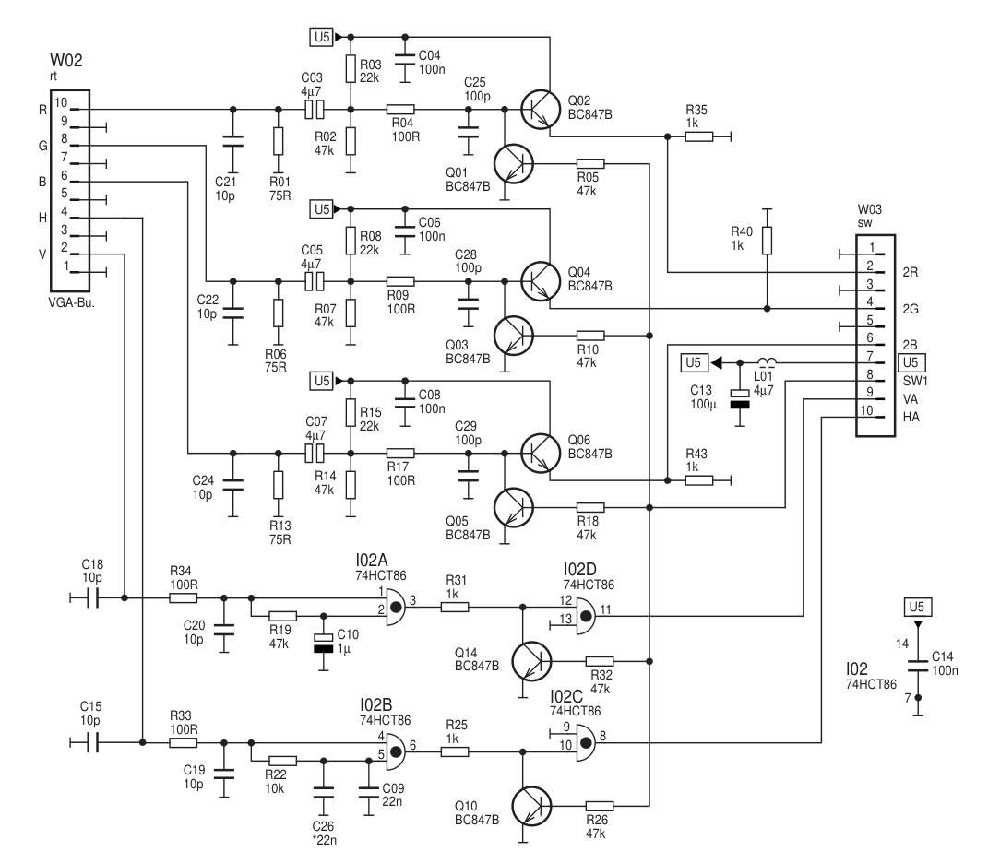
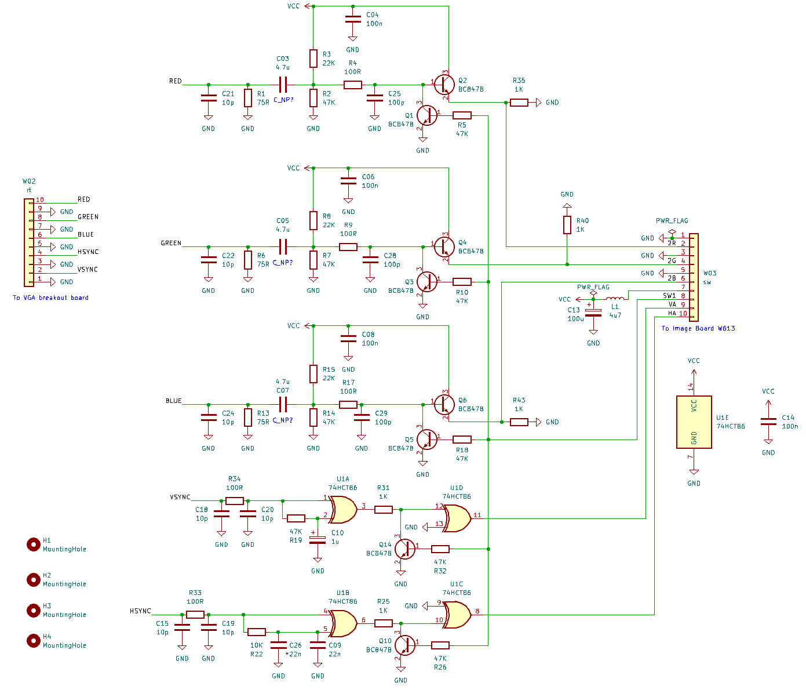
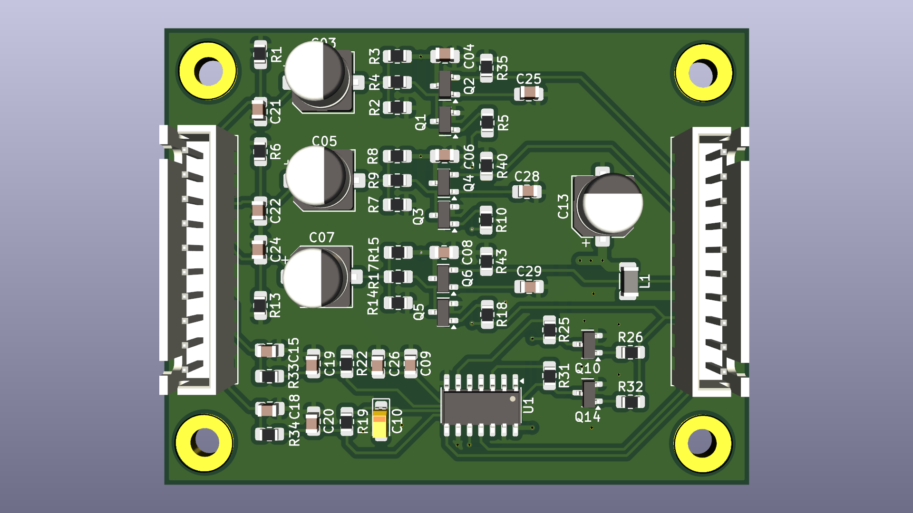
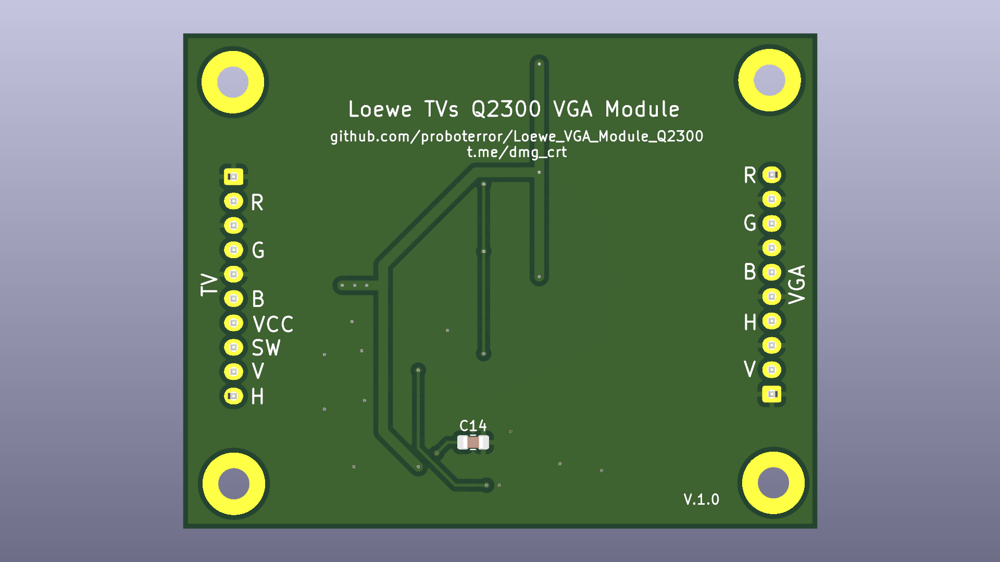
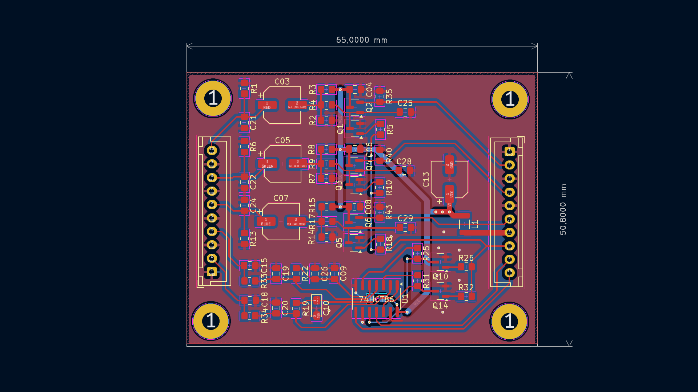
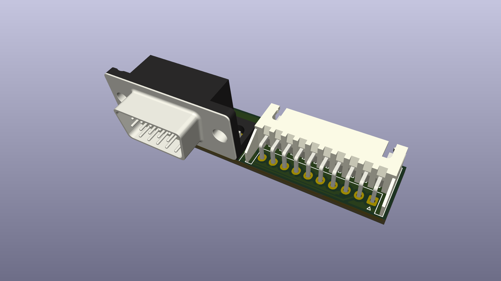
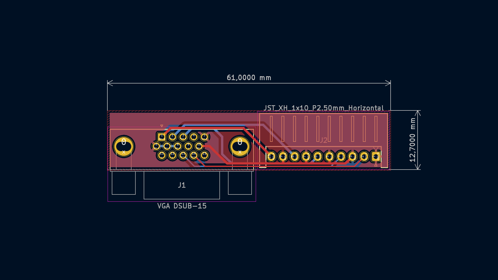
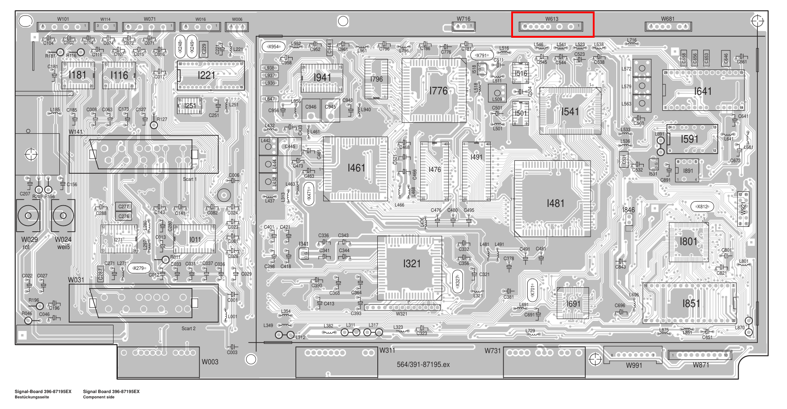

# Loewe TVs Q2300 VGA Module
Recreation of VGA module PCB for Loewe TVs with Q2300 chassis. 
[Loewe Q2400/Q2500 Chassis VGA Module](https://github.com/proboterror/Loewe_VGA_Module_Q2500)

Project based on schematic from [Loewe Q2300 Chassis Service Manual](doc/loewe_chassis_q2300.pdf)

Schematic and PCB recreated from the scratch in KiCad and verified with Desing/Electrical Rules Checker tools. 

Original schematic from [Loewe Q2300 Chassis Service Manual](doc/loewe_chassis_q2300.pdf):

Recreated schematic and PCB:

## Bill of materials
|Reference|Value|Footprint|Qty|
|-----|-----|-----|-----|
|C3,C5,C7|4.7u|Capacitor_SMD:CP_Elec_6.3x5.4|3|
|C4,C6,C8,C14|100n|0805|4|
|C9,C26|22n|0805|2|
|C10|1u|Capacitor_Tantalum_SMD CP_EIA-3216-18_Kemet-A_Pad1.58x1.35mm_HandSolder|1|
|C13|100u|Capacitor_SMD:CP_Elec_6.3x5.7|1|
|C15,C18,C19,C20,C21,C22,C24|10p|0805|7|
|C25,C28,C29|100p|0805|3|
|J1|VGA DSUB-15|DSUB-15-HD_Male_Horizontal_P2.29x1.98mm EdgePinOffset3.03mm_MountingHolesOffset4.94mm|1|
|J2|JST_XH_1x10_P2.50mm_Horizontal|JST_XH_S10B-XH-A_1x10_P2.50mm_Horizontal|1|
|L1|4u7|Inductor_SMD:1206|1|
|Q1,Q2,Q3,Q4,Q5,Q6,Q10,Q14|BC847B|SOT-23|8|
|R1,R6,R13|75R|0805|3|
|R2,R5,R7,R10,R14,R18,R19,R26,R32|47K|0805|9|
|R3,R8,R15|22K|0805|3|
|R4,R9,R17,R33,R34|100R|0805|5|
|R22|10K|0805|1|
|R25,R31,R35,R40,R43|1K|0805|5|
|U1|74HCT86|SO-14_3.9x8.65mm_P1.27mm|1|
|W2|rt|JST_XH_B10B-XH-A_1x10_P2.50mm_Vertical|1|
|W3|sw|JST_XH_B10B-XH-A_1x10_P2.50mm_Vertical|1|

+Cables XH 10 pin 20 + 30~50 cm, connectors: same side

## Order boards from manufacturer
Project split to 2 PCBs which should be ordered separately.
Send "gerbers\Breakout Board" and "gerbers\Main Board" folders content packed to separate zip archives.

## Build Notes
L1 inductor can be replaced with 0R resistor or solder bridge.

Pay attention on cables connectors type: same direction or reverse direction.

## Install
